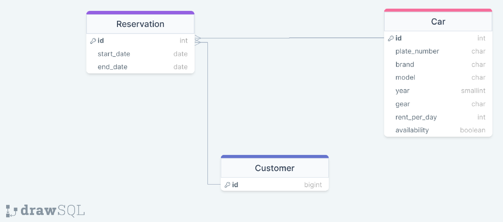

# Rent a car App

Rent a car app enables customers to rent autos between start and end date of their reservation.

## Installation

1. Clone the repository:

```
git clone https://github.com/omer-fsdev/rentacarApp_DjangoREST.git
```

2. Create a virtual environment and activate it:

```
   python -m venv env
   source env/bin/activate  # Linux/Mac
   .\env\Scripts\activate  # Windows
```

3. Install the required packages:

```

pip install -r requirements.txt

```

4. Run database migrations:

```
python manage.py migrate

```

5. Start the development server:

```
python manage.py runserver

```

6. Access the API documentation at https://rent-a-car-ni7m.onrender.com/swagger/ or https://rent-a-car-ni7m.onrender.com/redoc/.

## Project Plan

- Customers;
  - can select start and end date and see the list of available cars on selected dates.
  - can choose a car on the list and reserve that car, but can not reserve more than one car on a
    selected time period,
  - can see the list of their reservations including past ones.
  - can update reservations, but;
  - can not extend end dates if the car is reserved by other customers on selected time.
  - can delete their reservations.
- Admins;
  - can make CRUD operations on Car table,
  - can make CRUD operations on Customers table,
  - can make CRUD operations on Reservations table.

## Project ER-Diagram



## Contributing

Contributions are welcome! If you find any issues or have suggestions for improvement, please create an issue or submit a pull request.

## License

This project is licensed under the BSD License.
